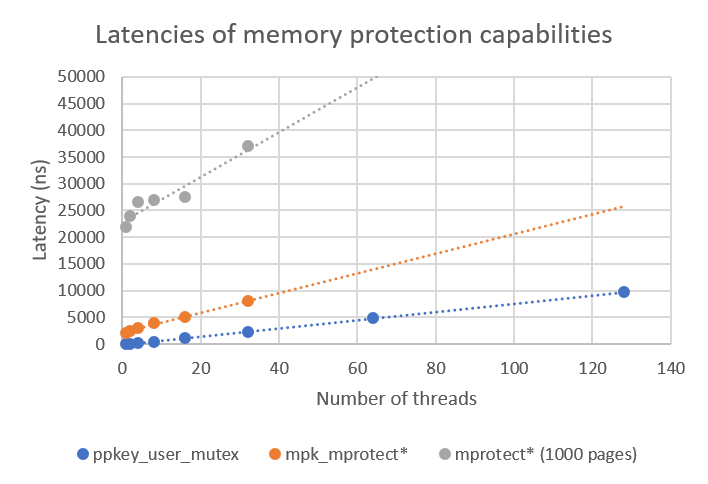
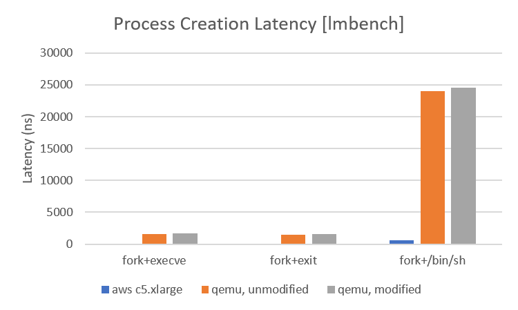

# mm_ppkeys_bench





```
gcc -I ./include/ -pthread -c -o ./objs/list.o ./src/list.c
gcc -I ./include/ -pthread -c -o ./objs/_libppkey.o ./src/libppkey.c
ld -relocatable ./objs/list.o ./objs/_libppkey.o -o libppkey.o

gcc -I ./include/ -pthread -c -o ./objs/libppkey_poc.o ./src/libppkey_poc.c
gcc -pthread -o ./libppkey_poc ./libppkey.o ./objs/libppkey_poc.o 
```