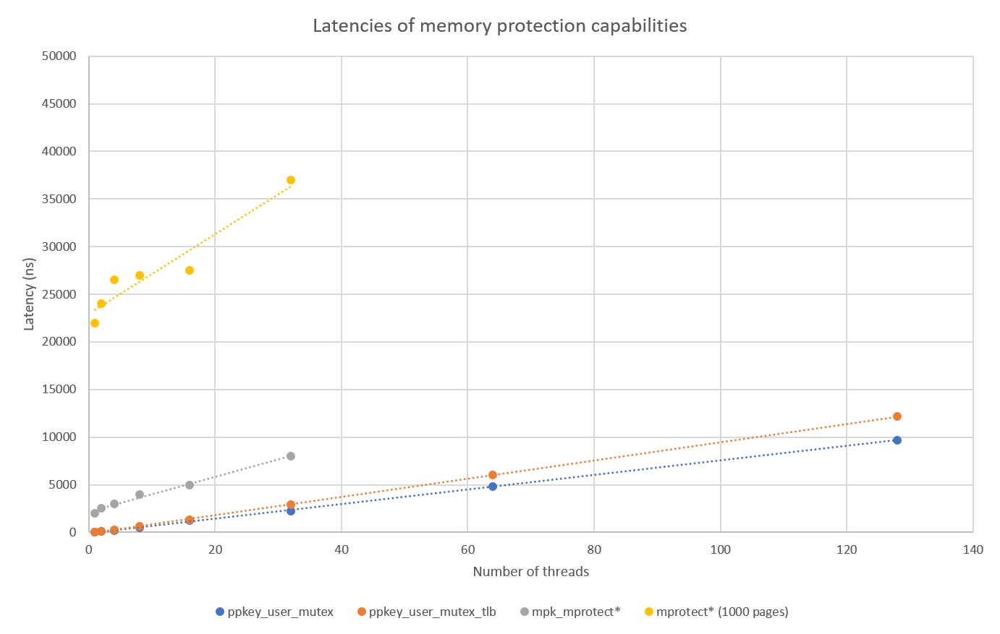

# mm_ppkeys_bench

gcc -I ./include/ -pthread -c -o ./objs/list.o ./src/list.c
gcc -I ./include/ -pthread -c -o ./objs/_libppkey.o ./src/libppkey.c
ld -relocatable ./objs/list.o ./objs/_libppkey.o -o libppkey.o

gcc -I ./include/ -pthread -c -o ./objs/ppkey_lib_test.o ./src/ppkey_lib_test.c
gcc -pthread -o ./ppkey_lib_test ./libppkey.o ./objs/ppkey_lib_test.o 